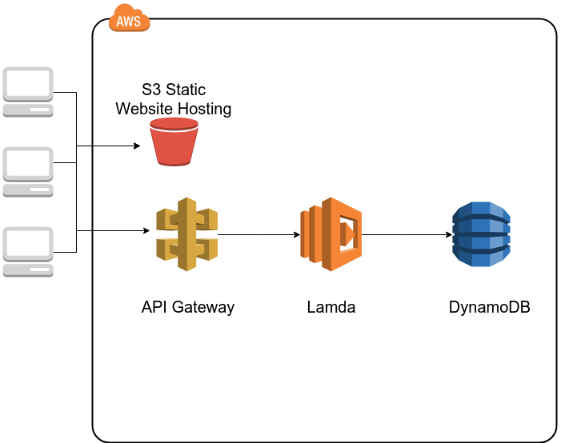

# Amazing Storm - Terraform

This project can be used to deploy:
 - web application 
 - backend with a database
 - infrastructure as a code
 
Both frontend and backend are built with nodeJS, AWS architecture is deployed with terraform.
 
 
## AWS Architecture

 
 
TODO:
- Create route 53 with delegation of:
     - production-tempete-de-direct.savarit.net
     - backend.production-tempete-de-direct.savarit.net
- Manage CNAME creation in terraform

## Continuous deployment

CD is done using Github actions.

Workflows are defined in .github/workflow/ :
- Node workflow to build & deploy frontend (S3)
- Terraform workflow to deploy AWS architecture

Workflows are triggered when a push occurs on the master branch.

TODO:
- Workflow to ZIP backend and copy to S3
- Add test + validation in workflows
- PR analysis + build
- Create other env. ex: develop (git) => staging (AWS)

## Frontend

Frontend is a basic [Hello word](http://production-tempete-de-direct.savarit.net.s3-website-eu-west-1.amazonaws.com/).

TODO:
- Create a real application
- Link it to the backend

## Backend

Backend is a simple script that can read or write in a database.

Usage:
curl -X POST -d '{"operation":"write","id":"1","name":"ram"}' https://6tmkr99l3e.execute-api.eu-west-1.amazonaws.com/production/myresource
curl -X POST -d '{"operation":"read","id":"1"}' https://6tmkr99l3e.execute-api.eu-west-1.amazonaws.com/production/myresource